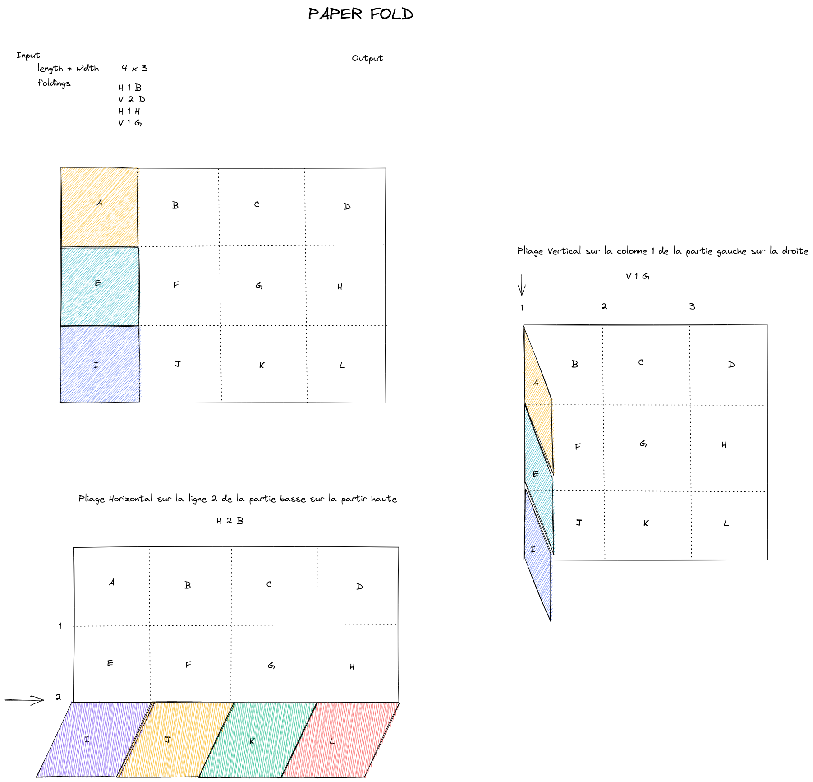

# starknet-paperfold

This repository is a Starknet smart contract that emulates the folding of a paper. The goal of this repository is to test/practice the grid (Vec<Vec<String>>) manipulation with cairo.

This repository contains 
- the source code of the smart contract
- some tests of the smart contract

## Folding paper

The paper is a grid of letters and can be folded only vertically or horizontally (i.e folding lines and columns in a grid).

One can fold horizontally one or more lines by folding the top part onto the bottom part (we will call this a top folding). 

One can fold horizontally one or more lines by folding the bottom part onto the top part (we will call this a bottom folding).

One can fold vertically one or more columns by folding the left part onto the right part (we will call this a left folding).

One can fold vertically one or more columns by folding the right part onto the left part (we will call this a right folding).

The picture below describes these possible foldings.

## Tests 

Tests can be launched with `snforge test`